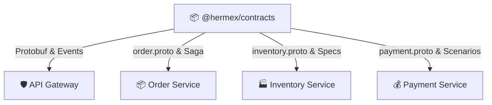

<div align="center">

# 📜 Hermex Contracts Library
### Protobuf Schemas, Saga Event Payloads & Topology Enums

[ **English** ] &nbsp;•&nbsp; [ [Українська](README.ua.md) ] &nbsp;•&nbsp; [ [System Overview](../overview/README.md) ] &nbsp;•&nbsp; [ [NPM Package](https://www.npmjs.com/package/@hermex/contracts) ]

<p align="center">
  @hermex/contracts (v1.4.1) &bull; Protobuf v3 &bull; Strict TypeScript DTOs &bull; Auto-Publish CI/CD
</p>

</div>

> **`@hermex/contracts`** is the single source of truth for all cross-service interfaces and event payloads across Hermex.  
> It packages Protocol Buffers (gRPC) schemas, typed Saga event payloads, RabbitMQ topology enums, domain models, and status code translation utilities.

---

## 🏛️ Architectural Purpose

In the Hermex microservices architecture, services are **strictly isolated** with zero cross-database access.  
All interactions (synchronous gRPC or asynchronous RabbitMQ messaging) are statically defined in `@hermex/contracts`.



---

## 📦 Package Structure

```text
contracts/
├── proto/                     # Protocol Buffers contracts
│   ├── order.proto            # Order creation & cancellation RPCs
│   ├── payment.proto          # Payment session & processing RPCs
│   └── inventory.proto        # Catalog, pagination & cart verification RPCs
├── src/
│   ├── enums/                 # Domain enums and queue topology
│   │   ├── order-status.enum.ts
│   │   ├── payment-status.enum.ts
│   │   ├── payment-scenario.enum.ts
│   │   └── rabbitmq-topology.enum.ts
│   ├── events/                # Saga event payload interfaces
│   │   ├── order.events.ts
│   │   ├── inventory.events.ts
│   │   └── payment.events.ts
│   ├── grpc/                  # TypeScript Protobuf definitions
│   │   ├── grpc-status.ts     # gRPC status codes & HTTP mappers
│   │   └── index.ts
│   └── index.ts               # Root exports barrel
```

---

## 🐇 RabbitMQ Topology Enums

```typescript
import { RabbitExchanges, OrderRoutingKeys, PaymentRoutingKeys } from '@hermex/contracts';

// Exchanges
RabbitExchanges.ORDER_TOPIC          // 'order.topic'
RabbitExchanges.INVENTORY_TOPIC      // 'inventory.topic'
RabbitExchanges.PAYMENT_TOPIC        // 'payment.topic'
RabbitExchanges.DEAD_LETTER_EXCHANGE // 'hermex.dlx'

// Event Routing Keys
OrderRoutingKeys.ORDER_CREATED       // 'order.created'
PaymentRoutingKeys.PAYMENT_FAILED    // 'payment.failed'
```

---

## 🔄 Saga Event Payloads

Every event carries an obligatory distributed `traceId`:

```typescript
export interface OrderCreatedPayload {
  orderId: string;
  userId: string;
  totalAmount: number;
  currency: string;
  items: Array<{
    productId: string;
    productTitle: string;
    quantity: number;
    unitPrice: number;
  }>;
  createdAt: string;
  traceId: string;
}
```

---

## 🌐 Protobuf Definitions

### 1. `order.proto`
- `CreateOrder(CreateOrderRequest) -> CreateOrderResponse`
- `GetOrderById(GetOrderByIdRequest) -> OrderMessage`
- `CancelOrder(CancelOrderRequest) -> CancelOrderResponse`

### 2. `inventory.proto`
- `GetProducts(GetProductsRequest) -> GetProductsResponse`
- `GetProductById(GetProductByIdRequest) -> GetProductByIdResponse`
- `ValidateCart(ValidateCartRequest) -> ValidateCartResponse`

### 3. `payment.proto`
- `CreatePaymentSession(CreatePaymentSessionRequest) -> CreatePaymentSessionResponse`
- `ProcessPayment(ProcessPaymentRequest) -> ProcessPaymentResponse`

---

## 🚀 Installation & Build

```bash
# Install in services
bun add @hermex/contracts

# Compile TypeScript
bun run build

# Publish to NPM (Automated via GitHub Actions on version bump)
```
