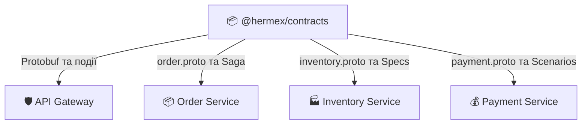

<div align="center">

# 📜 Бібліотека контрактів Hermex
### Схеми Protobuf, події Saga та енами топології

[ [English](README.md) ] &nbsp;•&nbsp; [ **Українська** ] &nbsp;•&nbsp; [ [Головний огляд](../overview/README.ua.md) ] &nbsp;•&nbsp; [ [NPM Пакет](https://www.npmjs.com/package/@hermex/contracts) ]

<p align="center">
  @hermex/contracts (v1.4.1) &bull; Protobuf v3 &bull; Суворі TypeScript DTO &bull; CI/CD автопублікація
</p>

</div>

> **`@hermex/contracts`** — єдине джерело правди для всіх міжсервісних інтерфейсів та подій платформи Hermex.  
> Містить схеми Protocol Buffers (gRPC), типізовані пейлоади подій Saga, енами топології RabbitMQ, доменні моделі та утиліти мапінгу статус-кодів.

---

## 🏛️ Архітектурне призначення

У мікросервісній архітектурі Hermex сервіси **суворо ізольовані** без прямого доступу до чужих баз даних.  
Будь-яка взаємодія (синхронна gRPC чи асинхронна через RabbitMQ) декларується в одному пакеті `@hermex/contracts`.



---

## 📦 Структура пакету

```text
contracts/
├── proto/                     # Схеми Protocol Buffers
│   ├── order.proto            # gRPC методи створення та скасування замовлень
│   ├── payment.proto          # gRPC методи сесій та проведення оплати
│   └── inventory.proto        # gRPC каталог, пагінація та валідація кошика
├── src/
│   ├── enums/                 # Доменні енами та топологія черг
│   │   ├── order-status.enum.ts
│   │   ├── payment-status.enum.ts
│   │   ├── payment-scenario.enum.ts
│   │   └── rabbitmq-topology.enum.ts
│   ├── events/                # Типи подій Saga
│   │   ├── order.events.ts
│   │   ├── inventory.events.ts
│   │   └── payment.events.ts
│   ├── grpc/                  # TypeScript інтерфейси Protobuf
│   │   ├── grpc-status.ts     # Коди gRPC та утиліти для HTTP
│   │   └── index.ts
│   └── index.ts               # Кореневий barrel-файл
```

---

## 🐇 Енами топології RabbitMQ

```typescript
import { RabbitExchanges, OrderRoutingKeys, PaymentRoutingKeys } from '@hermex/contracts';

// Обмінники
RabbitExchanges.ORDER_TOPIC          // 'order.topic'
RabbitExchanges.INVENTORY_TOPIC      // 'inventory.topic'
RabbitExchanges.PAYMENT_TOPIC        // 'payment.topic'
RabbitExchanges.DEAD_LETTER_EXCHANGE // 'hermex.dlx'

// Маршрути подій
OrderRoutingKeys.ORDER_CREATED       // 'order.created'
PaymentRoutingKeys.PAYMENT_FAILED    // 'payment.failed'
```

---

## 🔄 Події Saga (Event Payloads)

Кожна подія супроводжується обов'язковим ідентифікатором `traceId`:

```typescript
export interface OrderCreatedPayload {
  orderId: string;
  userId: string;
  totalAmount: number;
  currency: string;
  items: Array<{
    productId: string;
    productTitle: string;
    quantity: number;
    unitPrice: number;
  }>;
  createdAt: string;
  traceId: string;
}
```

---

## 🌐 Protobuf gRPC інтерфейси

### 1. `order.proto`
- `CreateOrder(CreateOrderRequest) -> CreateOrderResponse`
- `GetOrderById(GetOrderByIdRequest) -> OrderMessage`
- `CancelOrder(CancelOrderRequest) -> CancelOrderResponse`

### 2. `inventory.proto`
- `GetProducts(GetProductsRequest) -> GetProductsResponse`
- `GetProductById(GetProductByIdRequest) -> GetProductByIdResponse`
- `ValidateCart(ValidateCartRequest) -> ValidateCartResponse`

### 3. `payment.proto`
- `CreatePaymentSession(CreatePaymentSessionRequest) -> CreatePaymentSessionResponse`
- `ProcessPayment(ProcessPaymentRequest) -> ProcessPaymentResponse`

---

## 🚀 Встановлення та збірка

```bash
# Встановлення у сервісах
bun add @hermex/contracts

# Компіляція TypeScript
bun run build

# Публікація в NPM (автоматично через GitHub Actions при підвищенні версії)
```
